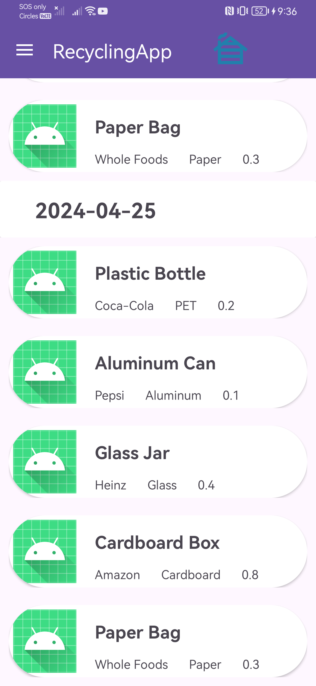

# GP-24s1 Report

The following is a report template to help your team successfully provide all the details necessary for your report in a structured and organised manner. Please give a straightforward and concise report that best demonstrates your project. Note that a good report will give a better impression of your project to the reviewers.

Note that you should have removed ALL TEMPLATE/INSTRUCTION texts in your submission (like the current sentence), otherwise it hampers the professionality in your documentation.

*Here are some tips to write a good report:*

* `Bullet points` are allowed and strongly encouraged for this report. Try to summarise and list the highlights of your project (rather than give long paragraphs).*

* *Try to create `diagrams` for parts that could greatly benefit from it.*

* *Try to make your report `well structured`, which is easier for the reviewers to capture the necessary information.*

*We give instructions enclosed in square brackets [...] and examples for each sections to demonstrate what are expected for your project report. Note that they only provide part of the skeleton and your description should be more content-rich. Quick references about markdown by [CommonMark](https://commonmark.org/help/)*

## Table of Contents

1. [Team Members and Roles](#team-members-and-roles)
2. [Summary of Individual Contributions](#summary-of-individual-contributions)
3. [Application Description](#application-description)
4. [Application UML](#application-uml)
5. [Application Design and Decisions](#application-design-and-decisions)
6. [Summary of Known Errors and Bugs](#summary-of-known-errors-and-bugs)
7. [Testing Summary](#testing-summary)
8. [Implemented Features](#implemented-features)
9. [Team Meetings](#team-meetings)
10. [Conflict Resolution Protocol](#conflict-resolution-protocol)

## Administrative
- Firebase Repository Link: <insert-link-to-firebase-repository>
    - Confirm: I have already added comp21006442@gmail.com as a Developer to the Firebase project prior to the due date.
- Two user accounts for markers' access are usable on the app's APK (do not change the username and password unless there are exceptional circumstances. Note that they are not real e-mail addresses in use):
    - Username: comp2100@anu.edu.au  Password: comp2100
    - Username: comp6442@anu.edu.au  Password: comp6442

## Team Members and Roles
The key area(s) of responsibilities for each member

| UID   |  Name  |   Role |
|:------|:------:|-------:|
| u7724204 | Julius Liem | Programmer |
| u7650334 | Harrison Black | Programmer |
| u7761531 | Devansu Yadav | Programmer |
| u7594144 | Le Thanh Nguyen | Programmer |


## Summary of Individual Contributions

1. **u7724204, Julius**  I have xx% contribution, as follows: <br>

* **Code Contribution in the final App**
    - Login Feature (State Design Pattern, Singleton Design Pattern) - class LoginState: [LoginState.java](/RecycleMe/app/src/main/java/com/example/recycleme/login/LoginState.java), [LoginContext.class](/RecycleMe/app/src/main/java/com/example/recycleme/login/LoginContext.java), [LoggedInState.class](/RecycleMe/app/src/main/java/com/example/recycleme/login/LoggedInState.java), [LoginActivity.class](/RecycleMe/app/src/main/java/com/example/recycleme/LoginActivity.java)
    - DAO design pattern - [RecycledItemDAO.class](/RecycleMe/app/src/main/java/com/example/recycleme/dao/RecycledItemDAO.java), [RecycledItemDAOJsonImp.class](/RecycleMe/app/src/main/java/com/example/recycleme/dao/RecycledItemDAOJsonImp.java)
    - RecycledItem model class - [RecycledItem.java](/RecycleMe/app/src/main/java/com/example/recycleme/model/RecycledItem.java)
    - RecycledItemDb class (Observer design pattern) - [RecycledItemDb.java](/RecycleMe/app/src/main/java/com/example/recycleme/util/RecycledItemDb.java)
    - Activity:
        - MainActivity class: [MainActivity.java](/RecycleMe/app/src/main/java/com/example/recycleme/MainActivity.java), 
        - BaseActivity class (adapted from StackOverflow, see code for full source): [BaseActivity.class](RecycleMe/app/src/main/java/com/example/recycleme/BaseActivity.java)
        - RecordActivity class: [RecordActivity.class](/RecycleMe/app/src/main/java/com/example/recycleme/RecordActivity.java)
    - Cart class (created by Harrison, modified by me): [Cart.class](RecycleMe/app/src/main/java/com/example/recycleme/cart/Cart.java)
    - NodeData class: [NodeData.java](RecycleMe/app/src/main/java/com/example/recycleme/cart/NodeData.java)
    - UserTree class: [UserTree.java](RecycleMe/app/src/main/java/com/example/recycleme/cart/UserTree.java)
    - AVLTree:
        - method `ceiling()`, `floor()`, and `findBetween()` on AVLTree class: [ceiling() and floor()](https://gitlab.cecs.anu.edu.au/u7724204/gp-24s1/-/blob/main/RecycleMe/app/src/main/java/com/example/recycleme/util/tree/AVLTree.java?ref_type=heads#L165-225), [findBetween()](https://gitlab.cecs.anu.edu.au/u7724204/gp-24s1/-/blob/main/RecycleMe/app/src/main/java/com/example/recycleme/util/tree/AVLTree.java?ref_type=heads#L295-317)
        - [AVLTreeItem.java](RecycleMe/app/src/main/java/com/example/recycleme/util/tree/AVLTreeItem.java)
        - [AVLTreeTime.java](RecycleMe/app/src/main/java/com/example/recycleme/util/tree/AVLTreeTime.java)
    - Adapter:
        - [CartViewAdapter.java](/RecycleMe/app/src/main/java/com/example/recycleme/adapter/CartViewAdapter.java)
        - [RecordAdapter.java](/RecycleMe/app/src/main/java/com/example/recycleme/adapter/RecordAdapter.java)
        - [RecycledViewAdapter.java](RecycleMe/app/src/main/java/com/example/recycleme/adapter/RecycledViewAdapter.java)

- **Code and App Design**
    - DAO design pattern, Observer design pattern, Singleton design pattern*
    - UI Design:
        - MainActivity layout: [activity_main.xml](/RecycleMe/app/src/main/res/layout/activity_main.xml)
        - BaseActivity layout: [activity_base.xml](/RecycleMe/app/src/main/res/layout/activity_base.xml)
        - LoginActivity layout: [activity_login.xml](RecycleMe/app/src/main/res/layout/activity_login.xml)
        - RecordActivity layout: [activity_record.xml](RecycleMe/app/src/main/res/layout/activity_record.xml)
        - RecyclerView row:
            - [cart_header.xml](RecycleMe/app/src/main/res/layout/cart_header.xml)
            - []

- **Others**: (only if significant and significantly different from an "average contribution")
    - [Report Writing?] [Slides preparation?]*
    - [You are welcome to provide anything that you consider as a contribution to the project or team.] e.g., APK, setups, firebase* <br><br>

2. **u7650334, Harrison**  I have xx% contribution, as follows: <br>
- **Code Contribution in the final App**
    - Cart feature (Singleton Design Pattern) - class Cart: [Cart.java](link_to_file),
    - Cart Layout - CartActivity class = [CartActivity.java](link_to_file), CartActivity layout: [CartActivity.xml](link_to_file)
    - Firebase based DAO - class RecycledItemDAO: [RecycledItemDAO.java](link_to_file), class RecycledItemDAOJsonImp: [FirebaseRecycledItemDAO.java](link_to_file)
    - Maps implementation (should be done soon)
    - Map layout (Should be done soon)

- **Code and App Design**
    - Singleton design pattern, DAO design pattern

3. **u7761531, Devansu**  I have xx% contronalityias follows: <br>
    - **Code Contribution in the final App**
        - Data Stream - `startStream()` and `stopStream()` methods in [RecycledItemDb.java](link_to_file), `onCreate()`, `update()` and `onDestroy()` methods in [MainActivity.java](link_to_file)
        - Search functionality (Tokenizer, Search Query Parser, Search Query evaluation) - class [Token.java](link_to_file), class [Tokenizer.java](link_to_file), class [SearchQueryParser.java](link_to_file), class [`SearchExp.java`](link_to_file), `onCreate()` method in [`MainActivity.java`](link_to_file), `search()` method in [`RecycledItemDB.java`](link_to_file)
        - Main app layout - MainActivity class: [MainActivity.java](link_to_file), MainActivity layout: [MainActivity.xml](link_to_file)
        - Unit Tests - class [TokenizerTest.java](link_to_file), class [SearchQueryParserTest.java](link_to_file)

- **Code and App Design**
    - [UI Design. Specify what design did the involved member propose? What tools were used for the design?]* <br><br>

- **Others**: (only if significant and significantly different from an "average contribution")
    - [Report Writing?] [Slides preparation?]*
    - [You are welcome to provide anything that you consider as a contribution to the project or team.] e.g., APK, setups, firebase* <br><br>
  

4. **u7594144,Thanh** I have xx% contribution, as follows: <br>
- **Code Contribution in the final App**
    - Login Feature (Firebase Authentication) - class LoginState: [LoginState.java](link_to_file), class LoginContext, class LoggedInState, class LoggedOutState, class LoginActivity, class LogUtil
    - Signup Feature (Firebase Authentication) - class SignupFragment: [SignupFragment.java](link_to_file)
    - Private Chat Feature (Firebase Realtime Databases) - class Message: [Message.java](link_to_class), class MessageAdapter: [MessageAdapter.java](link_to_class), class UserAdapter: [UserAdapter.java](link_to_class), class ChatsMainActivity: [ChatsMainActivity.java](link_to_class), class DirectMessageActivity: [DirectMessageActivity.java]
    - Data-Profile Feature - class ProfileActivity: [ProfileActivity.java]


- **Code and App Design**
    - DAO design pattern, Observer design pattern, Singleton design pattern*
    - [UI Design. Specify what design did the involved member propose? What tools were used for the design?]* <br><br>

- **Others**: (only if significant and significantly different from an "average contribution")
    - [Report Writing?] [Slides preparation?]*
    - [You are welcome to provide anything that you consider as a contribution to the project or team.] e.g., APK, setups, firebase* <br><br>

## Application Description

This is a recycling logging application. By using this application, we can log what we have recycled in each day, and we can see the statistics and history of our recycling history. This app also allows the users to see the nearest recycling spot. By logging in, the user can add their log, add their own personal recycled items, as well as see their statistics. They can also see the nearest location of recycling points.

### Application Use Cases and or Examples

Target users: people who want to log their recycling activities.

Molly wants to log her recycling activities.
1. Molly decides that she will embrace green lifestyle.
2. Molly downloads the RecycleMe app.
3. Now, Molly can see the list of common recycled items

<div style="text-align: center;">
    
</div>

4. She can search for items that she wants to recycle, and add it to her cart
<div style="text-align: center;">
    
</div>

5. Molly then can check out her cart to signify that she has finished recycling items
<div style="text-align: center;">
    
</div>

5. Molly then can check her recycling history and statistics
<div style="text-align: center;">
    
    
</div>

Target users: people who want to find friends in their recycling journey
1. Molly decides that she wants to find some friends who have the same green lifestyle
2. Molly downloads the app
3. Molly sees that there is a chat function which she can use to find new friends
4. Molly chat with her new friends


Target users: people who recycle large amounts of recycling, or do not have access to recycling bins at home.

Steve wants to recycle some stuff. (Will be possible soon)
1. Steve wants to recycle some items at a recycling plant.
2. Steve opens the app.
3. The app tells him where nearby recycling facilities are.

*Here is a map navigation application example*

*Targets Users: Drivers*

* *Users can use it to navigate in order to reach the destinations.*
* *Users can learn the traffic conditions*
* ...

*Target Users: Those who want to find some good restaurants*

* *Users can find nearby restaurants and the application can give recommendations*
* ...

*List all the use cases in text descriptions or create use case diagrams. Please refer to https://www.visual-paradigm.com/guide/uml-unified-modeling-language/what-is-use-case-diagram/ for use case diagram.*

<hr> 

### Application UML

 <br>
*[Replace the above with a class diagram. You can look at how we have linked an image here as an example of how you can do it too.]*

<hr>

## Code Design and Decisions

This is an important section of your report and should include all technical decisions made. Well-written justifications will increase your marks for both the report as well as for the relevant parts (e.g., data structure). This includes, for example,

- Details about the parser (describe the formal grammar and language used)

- Decisions made (e.g., explain why you chose one or another data structure, why you used a specific data model, etc.)

- Details about the design patterns used (where in the code, justification of the choice, etc)

### <u>Grammar(s)</u>
*[How do you design the grammar? What are the advantages of your designs?]*
*If there are several grammars, list them all under this section and what they relate to.*

We designed the grammar by first identifying what relevant information the user will want to search on the search bar. We ended up on item name, item brand and item material. We also thought there should be an "and" token to allow complex search queries.

Advantages of the design

* Expressiveness: The grammar allows for a wide range of valid search queries, including single-item queries, compound queries with conjunctions, and queries combining different search criteria (e.g., item name and brand).
* Flexibility: Users can input various types of queries, such as searching for specific items, filtering by brand or material, or combining multiple criteria in a single query.
* Clarity: The grammar provides clear rules for constructing valid search queries, making it easy for us to understand and implement search functionality.
* Scalability: The grammar can be extended to accommodate additional search criteria or features as the application evolves. For example, new types of recyclable items or search filters can be added without significant changes to the grammar.
* User-Friendly: By allowing users to input flexible and intuitive search queries, the grammar enhances the usability of the search bar, leading to a better overall user experience.

Production Rules:

   ```
   <SearchQuery>  ::=  <Item><Conjuction><Tag> | <Item> | <Tag>
   <Item>         ::=  "<String>"
   <String>       ::=  <Char> | <Char><String>
   <Char>         ::=  a | b | c | d | e | f | g | h | i | j | k | l | m | n | o | p | q | r | s | t | u | v | w | x | y | z
   <Conjunction>  ::=  "and"
   <Tag>          ::=  "#" <Item> | "@" <Item> | <Tag><Conjunction><Tag>
   ```

### <u>Tokenizers and Parsers</u>


We used tokenizers and parser in a search bar that allows the user filter out and find the specific recycled item they need.

<u>Tokenizer</u>

Our tokenizer is encapsulated within the [Tokenizer](https://gitlab.cecs.anu.edu.au/u7724204/gp-24s1/-/blob/main/RecycleMe/app/src/main/java/com/example/recycleme/search/Tokenizer.java?ref_type=heads) class, which contains the logic for extracting tokens from the input search query.

When we instantiate the Tokenizer class with a search query, and extract the first token using the `extractNextToken()` method.

In the `extractNextToken()` method, we follow a sequence of steps to identify and extract different types of tokens based on the above described grammar. We check the first character to determine the type of token (brand tag, material tag, conjunction, or item name). 
Based on the type of token, we invoke specific helper methods (`scanTag()`, `scanString()`, `checkAnd()`) to extract the token. After extracting the token, we update the `currentToken` variable and process the remaining portion of the search query.

Our tokenizer includes helper methods like `scanTag()` to scan for brand or material tags, `scanString()` to scan for item names, and `checkAnd()` to check for conjunctions.

We have also implemented error handling in our tokenizer. If we encounter an invalid character in the search query, we throw an exception to ensure robust error handling.

<u>Advantages of our tokenizer</u>
- The tokenizer has been designed in a way that allows our parser to fetch tokens on-demand when parsing a search query instead of extracting all tokens at once 
before parsing the query. This allows for a fast, and efficient way of processing queries both syntactically and semantically.
- Modularized and scalable to extract different types of tokens based on the grammar
- Invalid query filtering even before query parsing.

<u>Parser</u>

Our Parser has been implemented in the [SearchQueryParser](https://gitlab.cecs.anu.edu.au/u7724204/gp-24s1/-/blob/main/RecycleMe/app/src/main/java/com/example/recycleme/search/SearchQueryParser.java?ref_type=heads) class. 
By design, it has implemented as a Recursive Descent Parser, breaking down into each production rule of our grammar, parsing tokens from a user's search query 
in a left-to-right fashion. 

The parser parses different types of tokens extracted from the search query using the tokenizer, and efficiently checks for grammar violations and invalid search queries before parsing the rest of the query.
The `parseSearchQuery()` method is what we use to invoke the parser which generates a search expression as described using the [SearchExp.java](https://gitlab.cecs.anu.edu.au/u7724204/gp-24s1/-/blob/main/RecycleMe/app/src/main/java/com/example/recycleme/search/SearchExp.java?ref_type=heads) class.

The search expression after an entire query has been parsed consists of the parsed item name, list of brand names and materials. This parsed query is then
evaluated using the `evaluateSearchExp()` method in the [SearchExp.java](https://gitlab.cecs.anu.edu.au/u7724204/gp-24s1/-/blob/main/RecycleMe/app/src/main/java/com/example/recycleme/search/SearchExp.java?ref_type=heads#L25-L46) class which
searches for the user requested item in an AVL tree using a fast theta(log n) implementation.

<u>Advantage of the Parser</u>
- The query parser has been designed to process quite complex and powerful queries like searching for recycled items across multiple brands and materials providing 
a lot of flexibility to users.
- The parser can process and evaluate search queries in a fast and efficient manner.
- Effectively reports invalid search queries based on grammar violations.
- Easily scalable to handle more complex grammars allowing for even more powerful search queries.

### <u>Data structure(s)</u>

1. *HashMap*
    * Objective: used for storing the items in a cart
    * Code Locations: defined in [Class CartActivity, methods CartActivity(), addItem(), removeItem()](https://gitlab.cecs.anu.edu.au/u7724204/gp-24s1/-/blob/main/RecycleMe/app/src/main/java/com/example/recycleme/cart/Cart.java) processed using [setChartMaterials() and setChartRecycledItemOverTime() in class StatisticActivity](https://gitlab.cecs.anu.edu.au/u7724204/gp-24s1/-/blob/main/RecycleMe/app/src/main/java/com/example/recycleme/StatisticActivity.java)
    * *Reasons:*
        * We use HashMap because we need to categorize the RecycleItem based on their material. In order to do that, we need to have some sort of a Key-Value Pair
        * We don't need to access the item by index for the [Data-Graphical] feature because all of the data will be traversed

2. *AVLTree*
    * Objective: used for storing previously recycled items.
    * Code Locations: defined in [Class AVLTree](https://gitlab.cecs.anu.edu.au/u7724204/gp-24s1/-/blob/main/RecycleMe/app/src/main/java/com/example/recycleme/cart/AVLTree.java), used in [SearchExp.class, method evaluateSearchExp()](https://gitlab.cecs.anu.edu.au/u7724204/gp-24s1/-/blob/main/RecycleMe/app/src/main/java/com/example/recycleme/search/SearchExp.java?ref_type=heads#L25-L46), [AVLTreeItem.class](https://gitlab.cecs.anu.edu.au/u7724204/gp-24s1/-/blob/main/RecycleMe/app/src/main/java/com/example/recycleme/cart/AVLTreeItem.java?ref_type=heads), and [UserTree.class](https://gitlab.cecs.anu.edu.au/u7724204/gp-24s1/-/blob/main/RecycleMe/app/src/main/java/com/example/recycleme/cart/UserTree.java?ref_type=heads)
    * Reasons:
        * Using AVLTree guarantees a faster searching for recycled items. It has a theta(n) time complexity
        * We chose not to use RBTree because the amount of data is not that much. Using RBTree might have its benefits when the data is around 10,000, but when the data is only 2500, AVLTree is simpler to implement.
        * We chose not to use BST because AVLTree is similar to BST in terms of its complexity, but BST can lead to a big o of n in worst case.
    * We have AVLTreeItem and AVLTreeTime that inherits from AVLTree, both are used for different purposes.
        1. AVLTreeItem are used for storing the RecycledItem, here is the structure:
            * Structure: 
            * Reasons:  
                * We inherit AVLTree because this class has an extension that allows searching for item
                * The extra method is used to search for recycled items based on their name, brand, and materials
                * This is also why the keys used are name, brand, and materials
        2. AVLTreeTime
            * Objective: This class is used to save the user history
            * Structure: 
            * Reasons:
                * To make it easier using AVLTree directly with LocalDateTime
                * This class saves the item the user logged using a key pair because it will be further used in the statistic activity (to see the user's most common recycled items material)
        
3. ArrayList
    * Objective:
        * used for storing the items in the HashMap that's used in the Cart
        * used for showing the data in a RecyclerView
    * Reasons:
        * All of our adapter use ArrayList because it is the most convenient data structure for RecyclerView. If we use other kind of data structure, we would have to implement an iterator for it (and it’s not necessarily faster because in the end we would have to traverse the whole data).

<hr>

### Design Patterns

1. *Singleton Pattern*
    * Objective: To easily find the class instance when the users are going back and forth between activities
    * Code Locations: defined in [Cart.class, getInstance()](https://gitlab.cecs.anu.edu.au/u7724204/gp-24s1/-/blob/main/RecycleMe/app/src/main/java/com/example/recycleme/cart/Cart.java), [UserTree.class](https://gitlab.cecs.anu.edu.au/u7724204/gp-24s1/-/blob/main/RecycleMe/app/src/main/java/com/example/recycleme/cart/UserTree.java), [LoginContext.class](https://gitlab.cecs.anu.edu.au/u7724204/gp-24s1/-/blob/main/RecycleMe/app/src/main/java/com/example/recycleme/login/LoginContext.java), [RecycledItemDb.class](https://gitlab.cecs.anu.edu.au/u7724204/gp-24s1/-/blob/main/RecycleMe/app/src/main/java/com/example/recycleme/RecycledItemDb.java)
    * *Reasons:*
        * It is hard to pass Objects between activities, thus we decided to just create a singleton for Objects that are necessary to be kept in memory
        * All of these items are also logically should only be created once in the app:
            * Each users only have one cart
            * Each users have one history (stored in the UserTree.class)
            * LoginContext can only be invoked once per user
            * There is only one RecycledItemDb per user.
2. Observer Pattern
    * Objective: used for storing and notifying observers about changes in the list of recycled items in the RecycledItemDb feature.
    * Code Locations: 
    * Reasons:
        1. The Observer pattern allows for a design where the RecycledItemDb class can notify multiple observers (such as UI components or logging systems) about changes in the list of recycled items without those observers needing to know the details of the RecycledItemDb implementation.
        2. It allows new observers to be added without modifying the subject (RecycledItemDb) class.
        3. This pattern promotes reusability by separating concerns, making it easier to maintain and understand the codebase.
3. The State design pattern is used in the LoginContext class.
    * Objective: 
    * Reason: 
        * There are different actions that can be done depending on whether the user is logged in or logged out (e.g. when the user is logged out then the user can't add item to his cart history)
4. The DAO design pattern is used in reading the data instances. 
    * Objective: To read data instances from different locations
    * Reason: 
        * DAO design pattern is extensible, allowing the application to read the data both locally and from Firebase


<hr>


### Others

*[What other design decisions have you made which you feel are relevant? Feel free to separate these into their own subheadings.]*
*FirebaseUtil*
*

<br>
<hr>

## Implemented Features

### Basic Features
1. [LogIn] Users must be able to log in(easy)
    * Code: [Class LoggedOutState](RecycleMe/app/src/main/java/com/example/recycleme/login/LoggedInState.java), [Class LoginContext](RecycleMe/app/src/main/java/com/example/recycleme/login/LoginContext.java), [class LoginState](RecycleMe/app/src/main/java/com/example/recycleme/login/LoginState.java), [class LoginActivity](RecycleMe/app/src/main/java/com/example/recycleme/LoginActivity.java)
    * Description of feature: Users can login through LoginActivity and then it would be authenticated by Firebase
    * Description of your implementation: We implement this by using a LoginActivity alongside with LoginContext. The LoginContext, LoggedInState, and LoggedOutState class acts as a State design pattern.

2. [DataFiles]. Create a dataset with at least 2,500 valid data instances, each representing a meaningful piece of information in your app. The data should be represented and stored in a structured format taught in the course. (easy)
    * Code to the Data File [mock_data_updated.json](https://firebasestorage.googleapis.com/v0/b/recyclingapp-login-firebase.appspot.com/o/mock_data_updated.json?alt=media&token=0c0f46ad-1358-4949-9b9e-d1230e2b9ace)
    * Link to the Firebase repo: [repo](https://console.firebase.google.com/u/0/project/recyclingapp-login-firebase/overview)
    * Description of feature: 
        * We have a dataset of 2500 recycled items, each with its own ID, brand name, material, and value.
        * The data is uploaded into Firebase.

3. [LoadShowData] Load and display data instances from your dataset. Choose an appropriate format to present the different types of data. (easy)
    * Code: [MainActivity.java](), [RecycledViewAdapter.java](RecycleMe/app/src/main/java/com/example/recycleme/adapter/RecycledViewAdapter.java), [FirebaseRecycledItemDAO](RecycleMe/app/src/main/java/com/example/recycleme/dao/FirebaseRecycledItemDAO.java)
    * Description of feature: The MainActivity shows the list of recycled items and putting it as a list in the RecycledViewAdapter
    * Description of implementation: The MainActivity reads the data from RecycledItemDb.java (which uses Firebase as storage), and then load the data and put it inside RecycledViewAdapter.
4. [DataStream] Create data instances to simulate users’ actions and interactions, which are then used to feed the app so that when a user is logged in, these data are loaded at regular time intervals and visualised on the app. (medium)
    * Code: [RecycledItemDb.java, startStream(), stopStream(), and addRecycledItemToStream()](https://gitlab.cecs.anu.edu.au/u7724204/gp-24s1/-/blob/main/RecycleMe/app/src/main/java/com/example/recycleme/util/RecycledItemDb.java?ref_type=heads#L73-105)
    * Description of the feature: This feature will add a new item to the item list on MainActivity every 10 second. A toast message will be shown when new item is added.
    * Description of implementation: 
        * We used an Observer design pattern in order to implement this
        * First the RecycledItemDb will create a new thread, and then will add the item to the AVLTreeItem (which contains the list of items). 
        * Every time RecycledItemDb adds a new item, it will inform the Observer.
5. [Search] Users must be able to search for information on your app. (medium) Given the user's input based on pre-defined grammar(s), a query processor "understands" and retrieves the information that meets the user's query. The usag is dependent on your app theme.
a. must make use of a tokeniser and parser with a formal grammar of your own creation.
    * Code: [SearchExp.java](), [SearchQueryParser.java](), [Token.java](), [Tokenizer.java](), [MainActivity.java, line 58-88]()
    * Description of Implementation: 
        * The string will be read from the text input in the MainActivity.java. 
        * When the text string is read, it will use the SearchQueryParser class to parse the string. 
        * The SearchQueryParser class uses the Tokenizer class to tokenize the string, and then it uses the SearchExp.java to evaluate the expression
   <br>

### Custom Features
Firebase Integration
1. [FB-Auth]. Use Firebase to implement User Authentication/Authorisation. (easy)
    * Code: [Class LoggedOutState](RecycleMe/app/src/main/java/com/example/recycleme/login/LoggedOutState.java) and [Class LoggedInState](RecycleMe/app/src/main/java/com/example/recycleme/login/LoggedInState.java)
    * Description of your implementation: 
        * We used FirebaseAuth to validate user Login information stored in the Firebase Realtime databases
        * An AccountAction enum is used to differentiate between Login and Signup action
        * If logging in or signing up is successful, LoginContext will be set to LoggedInState, otherwise a Toast message will be displayed
2. [FB-Persist] Use Firebase to persist all data used in your app       (medium) 
    * Code: [Class FirebaseRecycledItemDAO](RecycleMe/app/src/main/java/com/example/recycleme/dao/FirebaseRecycledItemDAO.java)
    * Description of feature: We read data from Firebase for our List of Recycled Items
    * Description of implementation: The JSON file is uploaded to the Firebase, and then the FirebaseRecycledItemDAO parsed the json files and turns it into list of RecycledItem
    * Notes:
        * The stream data is not put into firebase, pursuant to the Ed answer given [here](https://edstem.org/au/courses/15738/discussion/1839054?comment=4335119)
        * The history data is not persisted in the Firebase, it is stored in memory.
3. [Data-Graphical] Create a Graphical report viewer to see a report of some useful data from your
app. No marks will be awarded if the report is non-graphical. (medium)
    * Code: [Class StatisticsActivity.java](RecycleMe/app/src/main/java/com/example/recycleme/StatisticActivity.java)
    * Description of feature: This feature will show the statistics:
        * Materials that the users have recycled (in pie chart)
        * The amount of items that the user has recycled per day (in bar chart)
    * Description of implementation: 
        * This statistics activity is implemented by using MPAndroidChart library. The Activity reads data from the UserTree (which contains the user's history)
        * The Activity then will process the data and show it as a graphical chart.
4. [P2P-DM] Provide users with the ability to message each other directly in private. (hard)
    * Code: []
    * Description of feature:
        * This allows a certain user to send direct message to other people.
    * Description of implementation:
        * 
5. [Interact-Follow] The ability to ‘follow’ items. There must be a section that presents all the items followed by a user, grouped, and ordered. [stored in-memory] (medium)
    * Code: [CartActivity.java](RecycleMe/app/src/main/java/com/example/recycleme/CartActivity.java), [Cart.java](RecycleMe/app/src/main/java/com/example/recycleme/cart/Cart.java)
    * Description of feature: The user can add things to their cart, and when they switch to the Cart activity, they can see that the items are being ordered according to the materials.
    * Image: 
    

<hr>

### Surprise Features

- Code Smell 1: **Couplers**
    - In the AVLTree class, previously the class was tightly coupled with the LocalDateTime class
    ```
        private class Node {
        LocalDateTime time;
        T value;
        Node left, right;
        int height;

        Node(LocalDateTime time, T value) {
            this.time = time;
            this.value = value;
            this.left = null;
            this.right = null;
            this.height = 0;
        }

        public LocalDateTime getTime() {
            return time;
        }
    ```
    - The node (and the class in whole) uses the LocalDateTime. This prevents other classes to use AVLTree
    - We fixed this by decoupling the LocalDateTime class and extends a new class that inherits AVLTree (AVLTreeTime)
    - So our Node class currently looks like this
    ```
        class Node {
        T value;
        Node left, right;
        int height;

        protected Node(T value) {
            this.value = value;
            this.left = null;
            this.right = null;
            this.height = 0;
        }
    ```
    - The class uses generics to let the user insert anything as the value of the AVLTree
    - The relevant git commit: [a87e0154](https://gitlab.cecs.anu.edu.au/u7724204/gp-24s1/-/commit/a87e0154d4aa8d97b67a47552779c31f1a1be8e6), and fixed in [e989af6d](https://gitlab.cecs.anu.edu.au/u7724204/gp-24s1/-/commit/e989af6d11a69c559020ae3e173348cdd649ae9f)
- Code Smell 2: **Multiple Responsibilities**
    - The [RecycledItemDb.java](RecycleMe/app/src/main/java/com/example/recycleme/util/RecycledItemDb.java) class has multiple responsibilities:
        - Handling DB operation
        - Managing streaming thread
        - Notifying observers
    - This class should be splitted into separate classes, each handling different aspects
    - However, we decided not to fix this as it takes time to split the class, and doing it with one week time can break the app.
- Code smell 3: **Duplicated code**
    - The BaseActivity.java class has a duplicated code where when starting new Activity, a new Intent is created in every if branch
    ```
    public boolean onNavigationItemSelected(MenuItem menuItem) {
        // Handle navigation item clicks
        if (menuItem.getItemId() == R.id.home) {
            Intent intent = new Intent(BaseActivity.this, MainActivity.class);
            startActivity(intent);
        } else if (menuItem.getItemId() == R.id.register_button) {
            if (LoginContext.getInstance().isLoggedIn()) {
                Intent intent = new Intent(BaseActivity.this, ProfileActivity.class);
                startActivity(intent);
            } else {
                Intent intent = new Intent(BaseActivity.this, LoginActivity.class);
                startActivity(intent);
            }
        } else if (menuItem.getItemId() == R.id.chats) {
            Intent intent = new Intent(BaseActivity.this, ChatsMainActivity.class);
            startActivity(intent);
        } else if (menuItem.getItemId() == R.id.cart) {
            Intent intent = new Intent(BaseActivity.this, CartActivity.class);
            startActivity(intent);
        } else if (menuItem.getItemId() == R.id.record) {
            Intent intent = new Intent(BaseActivity.this, RecordActivity.class);
            startActivity(intent);
        } else if (menuItem.getItemId() == R.id.statistic) {
            Intent intent = new Intent(BaseActivity.this, StatisticActivity.class);
            startActivity(intent);
        }
        // Close the navigation drawer
        drawerLayout.closeDrawer(GravityCompat.START);
        return true;
    }
    ```
    - This code violates the principle of DRY.
    - The relevant git commit is xxx, and we have 

<br> <hr>

## Summary of Known Errors and Bugs

*[Where are the known errors and bugs? What consequences might they lead to?]*
*List all the known errors and bugs here. If we find bugs/errors that your team does not know of, it shows that your testing is not thorough.*

*Here is an example:*

1. *Bug 1:*
    - *A space bar (' ') in the sign in email will crash the application.*
    - ...

2.  *Bug 2:*
- *Opening the Main Page for the first time causes the application to freeze as firebase downloads the required data.*
3. ...

<br> <hr>


## Testing Summary

*[What features have you tested? What is your testing coverage?]*
*Please provide some screenshots of your testing summary, showing the achieved testing coverage. Feel free to provide further details on your tests.*

*Here is an example:*

1. Tests for Search
    - Code: [TokenizerTest Class, entire file](https://gitlab.cecs.anu.edu.au/comp2100/group-project/ga-23s2/-/blob/main/items/media/_examples/Dummy.java) for the [Tokenizer Class, entire file](https://gitlab.cecs.anu.edu.au/comp2100/group-project/ga-23s2/-/blob/main/items/media/_examples/Dummy.java#L22-43)
    - *Number of test cases: ...*
    - *Code coverage: ...*
    - *Types of tests created and descriptions: ...*

2. xxx

...

<br> <hr>


## Team Management

### Meetings Records
* Link to the minutes of your meetings like above. There must be at least 4 team meetings.
  (each committed within 2 days after the meeting)
* Your meetings should also have a reasonable date spanning across Week 6 to 11.*


- *[Team Meeting 1](https://gitlab.cecs.anu.edu.au/u7724204/gp-24s1/-/blob/main/items/meeting_1_report.md)*
- *[Team Meeting 2](https://gitlab.cecs.anu.edu.au/u7724204/gp-24s1/-/blob/main/items/meeting_2_report.md)*
- *[Team Meeting 3](https://gitlab.cecs.anu.edu.au/u7724204/gp-24s1/-/blob/main/items/meeting_3_report.md)*
- *[Team Meeting 4](https://gitlab.cecs.anu.edu.au/u7724204/gp-24s1/-/blob/main/items/meeting_4_report.md)*
- *[Team Meeting 5](https://gitlab.cecs.anu.edu.au/u7724204/gp-24s1/-/blob/main/items/meeting-5-report.md)*

<hr>

### Conflict Resolution Protocol
*[Write a well defined protocol your team can use to handle conflicts. That is, if your group has problems, what is the procedure for reaching consensus or solving a problem?
(If you choose to make this an external document, link to it here)]*

-Disagreement on project direction: schedule meeting, discuss perspective, vote on best approach.

-If someone slows down: reach out to them, empathise with their situation.  If unresponsive, give a deadline.

-If there is a fight/personality disagreement: Uninvolved team members calm things down and help find solutions.


