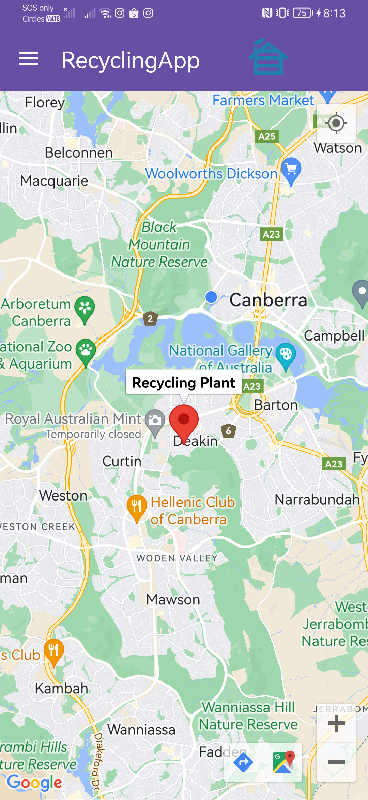

# GP-24s1 Report

This is a report made by the FlyingSpaghettiGod team. This report explains the app that we wrote as well as our process in writing the app.

## Table of Contents

1. [Team Members and Roles](#team-members-and-roles)
2. [Summary of Individual Contributions](#summary-of-individual-contributions)
3. [Application Description](#application-description)
4. [Application UML](#application-uml-diagram)
5. [Application Design and Decisions](#code-design-and-decisions)
6. [Summary of Known Errors and Bugs](#summary-of-known-errors-and-bugs)
7. [Testing Summary](#testing-summary)
8. [Implemented Features](#implemented-features)
9. [Team Meetings](#team-meetings)
10. [Conflict Resolution Protocol](#conflict-resolution-protocol)

## Administrative
* APK Location: [APK](apk/recycleme.apk)
- Firebase Repository Link: 
    - Link: [repo](https://console.firebase.google.com/u/0/project/recyclingapp-login-firebase/overview)
    * Link to the data file: [mock_data_updated.json](https://firebasestorage.googleapis.com/v0/b/recyclingapp-login-firebase.appspot.com/o/mock_data_updated.json?alt=media&token=0c0f46ad-1358-4949-9b9e-d1230e2b9ace)
    - Confirm: I have already added comp21006442@gmail.com as a Developer to the Firebase project prior to the due date.
- Two user accounts for markers' access are usable on the app's APK 
    - Username: comp2100@anu.edu.au  Password: comp2100
    - Username: comp6442@anu.edu.au  Password: comp6442
* Harrison has several github accounts in his computer so sometimes it gets weird and IntelliJ changes his accounts without him knowing. He committed by the name of Harrison and ExrosZ.
* We compiled this app using SDK 34. We've already asked permission in this [Ed post](https://edstem.org/au/courses/15738/discussion/1839054?comment=4178955)
* The features video can be found here: [features.mp4](items/features.mp4)

## ## Team Members and Roles
The key area(s) of responsibilities for each member

| UID      |      Name       |   Role |
|:---------|:---------------:|-------:|
| u7724204 |   Julius Liem   | Programmer |
| u7650334 | Harrison Black  | Programmer |
| u7761531 |  Devansu Yadav  | Programmer |
| u7594144 | Le Thanh Nguyen | Programmer |
| u7628910 |  Adam Basheer   | Programmer |

## Summary of Individual Contributions

1. **u7724204, Julius**  I have 22.5% contribution, as follows: <br>

* **Code Contribution in the final App**
    - Login Feature (State Design Pattern, Singleton Design Pattern) - class LoginState: [LoginState.java](/RecycleMe/app/src/main/java/com/example/recycleme/login/LoginState.java), [LoginContext.class](/RecycleMe/app/src/main/java/com/example/recycleme/login/LoginContext.java), [LoggedInState.class](/RecycleMe/app/src/main/java/com/example/recycleme/login/LoggedInState.java), [LoginActivity.class](/RecycleMe/app/src/main/java/com/example/recycleme/LoginActivity.java)
    - DAO design pattern - [RecycledItemDAO.class](/RecycleMe/app/src/main/java/com/example/recycleme/dao/RecycledItemDAO.java), [FirebaseRecycledItemDAO.java](RecycleMe/app/src/main/java/com/example/recycleme/dao/FirebaseRecycledItemDAO.java)
    - RecycledItem model class - [RecycledItem.java](/RecycleMe/app/src/main/java/com/example/recycleme/model/RecycledItem.java)
    - RecycledItemDb class (Observer design pattern) - [RecycledItemDb.java](/RecycleMe/app/src/main/java/com/example/recycleme/util/RecycledItemDb.java)
    - Activity:
        - MainActivity class: [MainActivity.java](/RecycleMe/app/src/main/java/com/example/recycleme/MainActivity.java), 
        - BaseActivity class (adapted from StackOverflow, see code for full source): [BaseActivity.class](RecycleMe/app/src/main/java/com/example/recycleme/BaseActivity.java)
        - RecordActivity class: [RecordActivity.class](/RecycleMe/app/src/main/java/com/example/recycleme/RecordActivity.java)
    - Cart class (created by Harrison, modified by me): [Cart.class](RecycleMe/app/src/main/java/com/example/recycleme/cart/Cart.java)
    - NodeData class: [NodeData.java](RecycleMe/app/src/main/java/com/example/recycleme/cart/NodeData.java)
    - UserTree class: [UserTree.java](RecycleMe/app/src/main/java/com/example/recycleme/cart/UserTree.java)
    - AVLTree:
        - method `ceiling()`, `floor()`, and `findBetween()` on AVLTree class: [ceiling() and floor()](https://gitlab.cecs.anu.edu.au/u7724204/gp-24s1/-/blob/main/RecycleMe/app/src/main/java/com/example/recycleme/util/tree/AVLTree.java?ref_type=heads#L165-225), [findBetween()](https://gitlab.cecs.anu.edu.au/u7724204/gp-24s1/-/blob/main/RecycleMe/app/src/main/java/com/example/recycleme/util/tree/AVLTree.java?ref_type=heads#L295-317)
        - [AVLTreeItem.java](RecycleMe/app/src/main/java/com/example/recycleme/util/tree/AVLTreeItem.java)
        - [AVLTreeTime.java](RecycleMe/app/src/main/java/com/example/recycleme/util/tree/AVLTreeTime.java)
    - Adapter:
        - [CartViewAdapter.java](/RecycleMe/app/src/main/java/com/example/recycleme/adapter/CartViewAdapter.java)
        - [RecordAdapter.java](/RecycleMe/app/src/main/java/com/example/recycleme/adapter/RecordAdapter.java)
        - [RecycledViewAdapter.java](RecycleMe/app/src/main/java/com/example/recycleme/adapter/RecycledViewAdapter.java)
    - Test:
        * [AVLTreeItemSearchIntegrationTest.java](RecycleMe/app/src/test/java/com/example/recycleme/AVLTreeItemSearchIntegrationTest.java)
        * [AVLTreeItemTest.java](RecycleMe/app/src/test/java/com/example/recycleme/AVLTreeItemTest.java)
        * [AVLTreeTest.java](RecycleMe/app/src/test/java/com/example/recycleme/AVLTreeTest.java)
        * [CartUserTreeIntegrationTest.java](RecycleMe/app/src/test/java/com/example/recycleme/CartUserTreeIntegrationTest.java)
        * [UserTreeTest.java](RecycleMe/app/src/test/java/com/example/recycleme/UserTreeTest.java)

- **Code and App Design**
    - DAO design pattern, Observer design pattern, Singleton design pattern*
    - UI Design:
        - MainActivity layout: [activity_main.xml](/RecycleMe/app/src/main/res/layout/activity_main.xml)
        - BaseActivity layout: [activity_base.xml](/RecycleMe/app/src/main/res/layout/activity_base.xml)
        - LoginActivity layout: [activity_login.xml](RecycleMe/app/src/main/res/layout/activity_login.xml)
        - RecordActivity layout: [activity_record.xml](RecycleMe/app/src/main/res/layout/activity_record.xml)
        - RecyclerView row:
            - [cart_header.xml](RecycleMe/app/src/main/res/layout/cart_header.xml)
            - [activity_cart.xml](RecycleMe/app/src/main/res/layout/activity_cart.xml)
            - [activity_login.xml](RecycleMe/app/src/main/res/layout/activity_login.xml)
            - [activity_record.xml](RecycleMe/app/src/main/res/layout/activity_record.xml)
            - [activity_statistic.xml](RecycleMe/app/src/main/res/layout/activity_statistic.xml)
            - [record_view_row.xml](RecycleMe/app/src/main/res/layout/record_view_row.xml)
            - [recycler_view_row.xml](RecycleMe/app/src/main/res/layout/record_view_row.xml)
            - [cart_view_row.xml](RecycleMe/app/src/main/res/layout/cart_view_row.xml)
            - [header_cart.xml](RecycleMe/app/src/main/res/layout/header_cart.xml)
            - [header_date_history.xml](RecycleMe/app/src/main/res/layout/header_date_history.xml)

- **Others**: 
    * Report Writing
    * UML diagram preparation
    * Data generation
     <br><br>

2. **u7650334, Harrison (ExrosZ: 167173157+ExrosZ@users.noreply.github.com)**  I have 22.5% contribution, as follows: <br>
- **Code Contribution in the final App**
    - Cart feature
        - [Cart.java](RecycleMe/app/src/main/java/com/example/recycleme/cart/Cart.java)
        - [CartActivity.java](RecycleMe/app/src/main/java/com/example/recycleme/CartActivity.java)
    - Firebase based DAO
        - [FirebaseRecycledItemDAO.java](RecycleMe/app/src/main/java/com/example/recycleme/dao/FirebaseRecycledItemDAO.java)
    - Maps implementation
        - [gpsMap.java](RecycleMe/app/src/main/java/com/example/recycleme/map/gpsMap.java)
        - [MapActivity.java](RecycleMe/app/src/main/java/com/example/recycleme/MapActivity.java)
- **Code and App Design**
    - DAO design pattern, Singleton design pattern
        - UI Design:
            - CartActivity layout: [activity_cart.xml](RecycleMe/app/src/main/res/layout/activity_cart.xml)
            - MapActivity layout: [activity_map.xml](RecycleMe/app/src/main/res/layout/activity_map.xml)
- **Others**:
    * Report writing
    * UML diagram
    * Firebase Storage
    * Features video [features.mp4](items/features.mp4)
    * I used my pc for a lot of the programming, and accidentally committed under the wrong account several times. (username: ExrosZ, Email: 167173157+ExrosZ@users.noreply.github.com)
      <br><br>


3. **u7761531, Devansu**  I have 22.5% contribution as follows: <br>
    - **Code Contribution in the final App**
        - Data Stream - `startStream()` and `stopStream()` methods in [RecycledItemDb.java](RecycleMe/app/src/main/java/com/example/recycleme/util/RecycledItemDb.java), `onCreate()`, `update()` and `onDestroy()` methods in [MainActivity.java](RecycleMe/app/src/main/java/com/example/recycleme/MainActivity.java)
        - Search functionality (Tokenizer, Search Query Parser, Search Query evaluation) - class [Token.java](RecycleMe/app/src/main/java/com/example/recycleme/search/Token.java), class [Tokenizer.java](RecycleMe/app/src/main/java/com/example/recycleme/search/Tokenizer.java), class [SearchQueryParser.java](RecycleMe/app/src/main/java/com/example/recycleme/search/SearchQueryParser.java), class [SearchExp.java](RecycleMe/app/src/main/java/com/example/recycleme/search/SearchExp.java), `onCreate()` method in [MainActivity.java](RecycleMe/app/src/main/java/com/example/recycleme/MainActivity.java), `search()` method in [RecycledItemDB.java](RecycleMe/app/src/main/java/com/example/recycleme/util/RecycledItemDb.java)
        - Surprise feature: Fixed the **Complex if-else** code smell in [BaseActivity.java](RecycleMe/app/src/main/java/com/example/recycleme/BaseActivity.java)
        - Refactored code in the following files: 
           * [RecycledItemDb.java](RecycleMe/app/src/main/java/com/example/recycleme/util/RecycledItemDb.java) 
           * [Tokenizer.java](RecycleMe/app/src/main/java/com/example/recycleme/search/Tokenizer.java)
        - Documented code in the following files:
           * [RecycledItemDb.java](RecycleMe/app/src/main/java/com/example/recycleme/util/RecycledItemDb.java)
           * [MainActivity.java](RecycleMe/app/src/main/java/com/example/recycleme/MainActivity.java)
           * [Token.java](RecycleMe/app/src/main/java/com/example/recycleme/search/Token.java)
           * [Tokenizer.java](RecycleMe/app/src/main/java/com/example/recycleme/search/Tokenizer.java)
           * [SearchQueryParser.java](RecycleMe/app/src/main/java/com/example/recycleme/search/SearchQueryParser.java)
           * [SearchExp.java](RecycleMe/app/src/main/java/com/example/recycleme/search/SearchExp.java)
           * [BaseActivity.java](RecycleMe/app/src/main/java/com/example/recycleme/BaseActivity.java)
        - Main app layout - MainActivity class: [MainActivity.java](RecycleMe/app/src/main/java/com/example/recycleme/MainActivity.java), MainActivity layout: [activity_main.xml](RecycleMe/app/src/main/res/layout/activity_main.xml)
        - Unit Tests:
           * class [TokenizerTest.java](RecycleMe/app/src/test/java/com/example/recycleme/TokenizerTest.java)
           * class [SearchQueryParserTest.java](RecycleMe/app/src/test/java/com/example/recycleme/SearchQueryParserTest.java)

- **Code and App Design**
    - UI Design:
        - MainActivity layout: [activity_main.xml](/RecycleMe/app/src/main/res/layout/activity_main.xml)
        - BaseActivity layout: [activity_base.xml](/RecycleMe/app/src/main/res/layout/activity_base.xml)

- **Others**: 
    * Report Writing
    * UML diagram preparation
    * Generate app's APK

4. **u7594144,Thanh** I have 22.5% contribution, as follows: <br>
- **Code Contribution in the final App**
    - Login Feature (Firebase Authentication): 
        - [LoginState.java](RecycleMe\app\src\main\java\com\example\recycleme\login\LoginState.java)
        - [LoggedInState.java](RecycleMe\app\src\main\java\com\example\recycleme\login\LoggedInState.java)
        - [LoggedOutState.java](RecycleMe\app\src\main\java\com\example\recycleme\login\LoggedOutState.java)
        - [LoginActivity.java](RecycleMe/app/src/main/java/com/example/recycleme/LoginActivity.java)
        - [LogUtil.java](RecycleMe/app/src/main/java/com/example/recycleme/util/LogUtil.java)
        - [AccountAction.java](RecycleMe\app\src\main\java\com\example\recycleme\login\AccountAction.java)
        - [SignupFragment.java](RecycleMe\app\src\main\java\com\example\recycleme\SignupFragment.java)
    - Private Chat Feature (Firebase Realtime Database): 
        - [Message.java](RecycleMe\app\src\main\java\com\example\recycleme\model\Message.java)
        - [MessageAdapter.java](RecycleMe\app\src\main\java\com\example\recycleme\adapter\MessageAdapter.java) 
        - [User.java](RecycleMe\app\src\main\java\com\example\recycleme\model\User.java) 
        - [UserAdapter.java](RecycleMe\app\src\main\java\com\example\recycleme\adapter\UserAdapter.java)
        - [ChatsMainActivity.java](RecycleMe\app\src\main\java\com\example\recycleme\ChatsMainActivity.java)
        - [DirectMessageActivity.java](RecycleMe\app\src\main\java\com\example\recycleme\DirectMessageActivity.java)
    - Data-Profile Feature: 
        - [ProfileActivity.java](RecycleMe\app\src\main\java\com\example\recycleme\ProfileActivity.java)
        - [ItemDescriptionActivity.java](RecycleMe\app\src\main\java\com\example\recycleme\ItemDescriptionActivity.java)
        - [ChatProfileViewActivity.java](RecycleMe\app\src\main\java\com\example\recycleme\ChatProfileViewActivity.java)
        - [UserProfileUtil.java](RecycleMe\app\src\main\java\com\example\recycleme\util\UserProfileUtil.java)
    - Data Structure: [AVLTree.java](RecycleMe/app/src/main/java/com/example/recycleme/util/tree/AVLTree.java)

- **Code and App Design**
    - UI Design:
        - [activity_chat_profile_view.xml](RecycleMe\app\src\main\res\layout\activity_chat_profile_view.xml)
        - [activity_chat_mains.xml](RecycleMe\app\src\main\res\layout\activity_chats_main.xml)
        - [activity_direct_message.xml](RecycleMe\app\src\main\res\layout\activity_direct_message.xml)
        - [activity_item_description.xml](RecycleMe\app\src\main\res\layout\activity_item_description.xml)
        - [activity_profile.xml](RecycleMe\app\src\main\res\layout\activity_profile.xml)
        - [fragment_signup.xml](RecycleMe\app\src\main\res\layout\fragment_signup.xml)
        - [message_view_row.xml](RecycleMe\app\src\main\res\layout\message_view_row.xml)
        - [receiving_view_row.xml](RecycleMe\app\src\main\res\layout\receiving_view_row.xml)
        - [sending_view_row.xml](RecycleMe\app\src\main\res\layout\sending_view_row.xml)

- **Others**: 
    - Firebase setup: Firebase Authentication, Firebase Realtime Database, Firebase Cloud Storage
    - UML Diagram
  <br><br>

5. **u7628910, Adam**  I have 10% contribution, as follows: <br>
   - **Code Contribution in the final App**
   - **Code and App Design**
   - **Others**

## Application Description

* This is a recycling logging application. 
* By using this application, we can log what we have recycled in each day, and we can see the statistics and history of our recycling history
* This app also allows the users to see the nearest recycling spot. 
* By logging in, the user can:
    * log their own personal recycled items 
    * see their recycling statistics. 
    * They can also see the nearest location of recycling points.
    * Users can also message each other once logged in.
    * Users can also find local recycling areas in their area.
    * They can also upload their own images to use as a profile picture.
* Users can also create an account if they do not already have one.

### Application Use Cases and or Examples

Target users: people who want to log their recycling activities.

Molly wants to log her recycling activities.
1. Molly decides that she will embrace green lifestyle.
2. Molly downloads the RecycleMe app.
3. Now, Molly can see the list of common recycled items

<div style="text-align: center;">
    
</div>

4. She can search for items that she wants to recycle, and add it to her cart
<div style="text-align: center;">
    
</div>

5. Molly then can check out her cart to signify that she has finished recycling items
<div style="text-align: center;">
    
</div>

5. Molly then can check her recycling history and statistics
<div style="text-align: center;">
    
    
</div>

Target users: people who want to find friends in their recycling journey
1. Molly decides that she wants to find some friends who have the same green lifestyle
2. Molly downloads the app
3. Molly sees that there is a chat function which she can use to find new friends
4. Molly chat with her new friends
<div style="text-align: center;">
    
</div>


Target users: people who recycle large amounts of recycling, or do not have access to recycling bins at home.

Steve wants to recycle some stuff.
1. Steve wants to recycle some items at a recycling plant.
2. Steve opens the app.
3. The app tells him where nearby recycling facilities are.
<div style="text-align: center;">
    
</div>


<hr> 

### Application UML Diagram

<div style="text-align: center;">
    
</div>

In case the above UML diagram isn't clearly visible, please check out this link to view the online version on draw.io: [RecycleMe UML](https://drive.google.com/file/d/1R9BmTHUoWhKgGoRLjrAQ_Wua_rYmLm9Z/view?usp=sharing)
<hr>

## Code Design and Decisions

### <u>Grammar(s)</u>

We designed the grammar by first identifying what relevant information the user will want to search on the search bar. We ended up on item name, item brand and item material. We also thought there should be an "and" token to allow complex search queries.

Advantages of the design

* Expressiveness: The grammar allows for a wide range of valid search queries, including single-item queries, compound queries with conjunctions, and queries combining different search criteria (e.g., item name and brand).
* Flexibility: Users can input various types of queries, such as searching for specific items, filtering by brand or material, or combining multiple criteria in a single query.
* Clarity: The grammar provides clear rules for constructing valid search queries, making it easy for us to understand and implement search functionality.
* Scalability: The grammar can be extended to accommodate additional search criteria or features as the application evolves. For example, new types of recyclable items or search filters can be added without significant changes to the grammar.
* User-Friendly: By allowing users to input flexible and intuitive search queries, the grammar enhances the usability of the search bar, leading to a better overall user experience.

Production Rules:

   ```
   <SearchQuery>  ::=  <Item><Conjuction><Tag> | <Item> | <Tag>
   <Item>         ::=  "<String>"
   <String>       ::=  <Char> | <Char><String>
   <Char>         ::=  a | b | c | d | e | f | g | h | i | j | k | l | m | n | o | p | q | r | s | t | u | v | w | x | y | z
   <Conjunction>  ::=  "and"
   <Tag>          ::=  "#" <Item> | "@" <Item> | <Tag><Conjunction><Tag>
   ```

### <u>Tokenizers and Parsers</u>


We used tokenizers and parser in a search bar that allows the user filter out and find the specific recycled item they need.

<u>Tokenizer</u>

Our tokenizer is encapsulated within the [Tokenizer](https://gitlab.cecs.anu.edu.au/u7724204/gp-24s1/-/blob/main/RecycleMe/app/src/main/java/com/example/recycleme/search/Tokenizer.java?ref_type=heads) class, which contains the logic for extracting tokens from the input search query.

When we instantiate the Tokenizer class with a search query, and extract the first token using the `extractNextToken()` method.

In the `extractNextToken()` method, we follow a sequence of steps to identify and extract different types of tokens based on the above described grammar. We check the first character to determine the type of token (brand tag, material tag, conjunction, or item name). 
Based on the type of token, we invoke specific helper methods (`scanTag()`, `scanString()`, `checkAnd()`) to extract the token. After extracting the token, we update the `currentToken` variable and process the remaining portion of the search query.

Our tokenizer includes helper methods like `scanTag()` to scan for brand or material tags, `scanString()` to scan for item names, and `checkAnd()` to check for conjunctions.

We have also implemented error handling in our tokenizer. If we encounter an invalid character in the search query, we throw an exception to ensure robust error handling.

<u>Advantages of our tokenizer</u>
- The tokenizer has been designed in a way that allows our parser to fetch tokens on-demand when parsing a search query instead of extracting all tokens at once 
before parsing the query. This allows for a fast, and efficient way of processing queries both syntactically and semantically.
- Modularized and scalable to extract different types of tokens based on the grammar
- Invalid query filtering even before query parsing.

<u>Parser</u>

Our Parser has been implemented in the [SearchQueryParser](https://gitlab.cecs.anu.edu.au/u7724204/gp-24s1/-/blob/main/RecycleMe/app/src/main/java/com/example/recycleme/search/SearchQueryParser.java?ref_type=heads) class. 
By design, it has implemented as a Recursive Descent Parser, breaking down into each production rule of our grammar, parsing tokens from a user's search query 
in a left-to-right fashion. 

The parser parses different types of tokens extracted from the search query using the tokenizer, and efficiently checks for grammar violations and invalid search queries before parsing the rest of the query.
The `parseSearchQuery()` method is what we use to invoke the parser which generates a search expression as described using the [SearchExp.java](https://gitlab.cecs.anu.edu.au/u7724204/gp-24s1/-/blob/main/RecycleMe/app/src/main/java/com/example/recycleme/search/SearchExp.java?ref_type=heads) class.

The search expression after an entire query has been parsed consists of the parsed item name, list of brand names and materials. This parsed query is then
evaluated using the `evaluateSearchExp()` method in the [SearchExp.java](https://gitlab.cecs.anu.edu.au/u7724204/gp-24s1/-/blob/main/RecycleMe/app/src/main/java/com/example/recycleme/search/SearchExp.java?ref_type=heads#L25-L46) class which
searches for the user requested item in an AVL tree using a fast theta(log n) implementation.

<u>Advantage of the Parser</u>
- The query parser has been designed to process quite complex and powerful queries like searching for recycled items across multiple brands and materials providing 
a lot of flexibility to users.
- The parser can process and evaluate search queries in a fast and efficient manner.
- Effectively reports invalid search queries based on grammar violations.
- Easily scalable to handle more complex grammars allowing for even more powerful search queries.

### <u>Data structure(s)</u>

1. *HashMap*
    * Objective: used for storing the items in a cart
    * Code Locations: defined in [Class CartActivity, methods CartActivity(), addItem(), removeItem()](https://gitlab.cecs.anu.edu.au/u7724204/gp-24s1/-/blob/main/RecycleMe/app/src/main/java/com/example/recycleme/cart/Cart.java) processed using [setChartMaterials() and setChartRecycledItemOverTime() in class StatisticActivity](https://gitlab.cecs.anu.edu.au/u7724204/gp-24s1/-/blob/main/RecycleMe/app/src/main/java/com/example/recycleme/StatisticActivity.java)
    * *Reasons:*
        * We use HashMap because we need to categorize the RecycleItem based on their material. In order to do that, we need to have some sort of a Key-Value Pair
        * We don't need to access the item by index for the [Data-Graphical] feature because all of the data will be traversed

2. *AVLTree*
    * Objective: used for storing previously recycled items.
    * Code Locations: defined in [Class AVLTree](https://gitlab.cecs.anu.edu.au/u7724204/gp-24s1/-/blob/main/RecycleMe/app/src/main/java/com/example/recycleme/cart/AVLTree.java), used in [SearchExp.class, method evaluateSearchExp()](https://gitlab.cecs.anu.edu.au/u7724204/gp-24s1/-/blob/main/RecycleMe/app/src/main/java/com/example/recycleme/search/SearchExp.java?ref_type=heads#L25-L46), [AVLTreeItem.class](https://gitlab.cecs.anu.edu.au/u7724204/gp-24s1/-/blob/main/RecycleMe/app/src/main/java/com/example/recycleme/cart/AVLTreeItem.java?ref_type=heads), and [UserTree.class](https://gitlab.cecs.anu.edu.au/u7724204/gp-24s1/-/blob/main/RecycleMe/app/src/main/java/com/example/recycleme/cart/UserTree.java?ref_type=heads)
    * Reasons:
        * Using AVLTree guarantees a faster searching for recycled items. It has a theta(n) time complexity
        * We chose not to use RBTree because the amount of data is not that much. Using RBTree might have its benefits when the data is around 10,000, but when the data is only 2500, AVLTree is simpler to implement.
        * We chose not to use BST because AVLTree is similar to BST in terms of its complexity, but BST can lead to a big o of n in worst case.
    * We have AVLTreeItem and AVLTreeTime that inherits from AVLTree, both are used for different purposes.
        1. AVLTreeItem are used for storing the RecycledItem, here is the structure:
            * Structure: 
            * Reasons:  
                * We inherit AVLTree because this class has an extension that allows searching for item
                * The extra method is used to search for recycled items based on their name, brand, and materials
                * This is also why the keys used are name, brand, and materials
        2. AVLTreeTime
            * Objective: This class is used to save the user history
            * Structure: 
            * Reasons:
                * To make it easier using AVLTree directly with LocalDateTime
                * This class saves the item the user logged using a key pair because it will be further used in the statistic activity (to see the user's most common recycled items material)
        
3. ArrayList
    * Objective:
        * used for storing the items in the HashMap that's used in the Cart
        * used for showing the data in a RecyclerView
        * Code locations:
            * All of the com.example.recycleme.adapter package
            * [UserTree.java](RecycleMe/app/src/main/java/com/example/recycleme/cart/UserTree.java) - because it interacts with recycler view adapter
            * [FirebaseRecycledItemDAO.java](RecycleMe/app/src/main/java/com/example/recycleme/dao/FirebaseRecycledItemDAO.java)
            * [AVLTree.java](RecycleMe/app/src/main/java/com/example/recycleme/util/tree/AVLTree.java)
            * [AVLTreeItem.java](RecycleMe/app/src/main/java/com/example/recycleme/util/tree/AVLTreeItem.java)
            * [AVLTreeTime.java](RecycleMe/app/src/main/java/com/example/recycleme/util/tree/AVLTreeTime.java)
    * Reasons:
        * All of our adapter use ArrayList because it is the most convenient data structure for RecyclerView. If we use other kind of data structure, we would have to implement an iterator for it (and it’s not necessarily faster because in the end we would have to traverse the whole data).
        * For UserTree, because the UserTree interacts directly with recyclerview (and the most convenient data structure for recyclerview is a List)
        * For FirebaseRecycledItemDAO, because we need to put all of the read items into a recyclerview.
        * For AVLTree, AVLTreeItem, and AVLTreeTime, it's because sometimes there is a need to traverse all of the nodes in order to show it to the user. We decided that ArrayList is the best data structure to store all of it.

4. HashSet
    * Objective:
        * Used for storing brand name and item name in the SearchQueryParser
    * Code location:
        * [parseBrandAndMaterial() in SearchQueryParser.java](https://gitlab.cecs.anu.edu.au/u7724204/gp-24s1/-/blob/main/RecycleMe/app/src/main/java/com/example/recycleme/search/SearchQueryParser.java?ref_type=heads#L96-131)
    * Reasons:
        * We used HashSet in order to filter double strings that might enter the search query. 

    

### Design Patterns

1. *Singleton Pattern*
    * Objective: To easily find the class instance when the users are going back and forth between activities
    * Code Locations: defined in [Cart.class, getInstance()](https://gitlab.cecs.anu.edu.au/u7724204/gp-24s1/-/blob/main/RecycleMe/app/src/main/java/com/example/recycleme/cart/Cart.java), [UserTree.class](https://gitlab.cecs.anu.edu.au/u7724204/gp-24s1/-/blob/main/RecycleMe/app/src/main/java/com/example/recycleme/cart/UserTree.java), [LoginContext.class](https://gitlab.cecs.anu.edu.au/u7724204/gp-24s1/-/blob/main/RecycleMe/app/src/main/java/com/example/recycleme/login/LoginContext.java), [RecycledItemDb.class](https://gitlab.cecs.anu.edu.au/u7724204/gp-24s1/-/blob/main/RecycleMe/app/src/main/java/com/example/recycleme/RecycledItemDb.java)
    * *Reasons:*
        * It is hard to pass Objects between activities, thus we decided to just create a singleton for Objects that are necessary to be kept in memory
        * All of these items are also logically should only be created once in the app:
            * Each users only have one cart
            * Each users have one history (stored in the UserTree.class)
            * LoginContext can only be invoked once per user
            * There is only one RecycledItemDb per user.
2. Observer Pattern
    * Objective: used for storing and notifying observers about changes in the list of recycled items in the RecycledItemDb feature.
    * Code Locations: 
        * [MainActivity.java - update() method](https://gitlab.cecs.anu.edu.au/u7724204/gp-24s1/-/blob/main/RecycleMe/app/src/main/java/com/example/recycleme/MainActivity.java?ref_type=heads#L107-123), 
        *  [RecycledItemDb.java](https://gitlab.cecs.anu.edu.au/u7724204/gp-24s1/-/blob/main/RecycleMe/app/src/main/java/com/example/recycleme/util/RecycledItemDb.java#L107-121), 
        * [Subject.java](RecycleMe/app/src/main/java/com/example/recycleme/interfaces/Subject.java), 
        * [Observer.java](RecycleMe/app/src/main/java/com/example/recycleme/interfaces/Subject.java)
    * Reasons:
        1. The Observer pattern allows for a design where the RecycledItemDb class can notify multiple observers (such as UI components or logging systems) about changes in the list of recycled items without those observers needing to know the details of the RecycledItemDb implementation.
        2. It allows new observers to be added without modifying the subject (RecycledItemDb) class.
        3. This pattern promotes reusability by separating concerns, making it easier to maintain and understand the codebase.
3. The State design pattern is used in the LoginContext class.
    * Objective: User have different states for when the user is logged in or logged out, which facilitates the management of user authentication in the application. By utilizing different states, the system can behave differently based on the user's authentication status.
    * Code Locations: [LoginContext.java](RecycleMe/app/src/main/java/com/example/recycleme/login/LoginContext.java)
    * Reason: 
        * There are different actions that can be done depending on whether the user is logged in or logged out (e.g. when the user is logged out then the user can't add item to his cart history)
4. The DAO design pattern is used in reading the data instances. 
    * Objective: To read data instances from different locations
    * Code Locations: 
        * [FirebaseRecycledItemDAO.java](RecycleMe/app/src/main/java/com/example/recycleme/dao/FirebaseRecycledItemDAO.java)
    * Reason: 
        * DAO design pattern is extensible, allowing the application to read the data both locally and from Firebase.
        * Previously, we have a class called [RecycledItemDAO.java](RecycleMe/app/src/main/java/com/example/recycleme/dao/RecycledItemDAO.java). However, the class is now deleted. By using the DAO design pattern, it allows the app to either read directly from firebase or to read locally
5. The Facade design pattern
    * Objective: The facade design pattern is used to simplify the user interaction between the activities and the AVLTree.
    * Code location: [AVLTreeTime.java](RecycleMe/app/src/main/java/com/example/recycleme/util/tree/AVLTreeItem.java)
    * Reason: We implemented the facade because it would simplify the interaction between AVLTree and NodeData. If we use AVLTree directly, we would have to create a new NodeData every time we want to put things inside the Tree. 


<hr>


### Others
* We use JSON to store our data because it's supported by the GSON library and it immensely helped us in creating objects in just few lines of code.

<br>
<hr>

## Implemented Features

### Basic Features
1. [LogIn] Users must be able to log in(easy)
    * Code: [Class LoggedOutState](RecycleMe/app/src/main/java/com/example/recycleme/login/LoggedInState.java), [Class LoginContext](RecycleMe/app/src/main/java/com/example/recycleme/login/LoginContext.java), [class LoginState](RecycleMe/app/src/main/java/com/example/recycleme/login/LoginState.java), [class LoginActivity](RecycleMe/app/src/main/java/com/example/recycleme/LoginActivity.java)
    * Description of feature: Users can login through LoginActivity and then it would be authenticated by Firebase
    * Description of your implementation: We implement this by using a LoginActivity alongside with LoginContext. The LoginContext, LoggedInState, and LoggedOutState class acts as a State design pattern.

2. [DataFiles]. Create a dataset with at least 2,500 valid data instances, each representing a meaningful piece of information in your app. The data should be represented and stored in a structured format taught in the course. (easy)
    * Link to the Data File [mock_data_updated.json](https://firebasestorage.googleapis.com/v0/b/recyclingapp-login-firebase.appspot.com/o/mock_data_updated.json?alt=media&token=0c0f46ad-1358-4949-9b9e-d1230e2b9ace)
    * Link to the Firebase repo: [repo](https://console.firebase.google.com/u/0/project/recyclingapp-login-firebase/overview)
    * Description of feature: 
        * We have a dataset of 2500 recycled items, each with its own ID, brand name, material, and value.
        * The data is uploaded into Firebase.

3. [LoadShowData] Load and display data instances from your dataset. Choose an appropriate format to present the different types of data. (easy)
    * Code: [MainActivity.java](), [RecycledViewAdapter.java](RecycleMe/app/src/main/java/com/example/recycleme/adapter/RecycledViewAdapter.java), [FirebaseRecycledItemDAO](RecycleMe/app/src/main/java/com/example/recycleme/dao/FirebaseRecycledItemDAO.java)
    * Description of feature: The MainActivity shows the list of recycled items and putting it as a list in the RecycledViewAdapter
    * Description of implementation: The MainActivity reads the data from RecycledItemDb.java (which uses Firebase as storage), and then load the data and put it inside RecycledViewAdapter.
4. [DataStream] Create data instances to simulate users’ actions and interactions, which are then used to feed the app so that when a user is logged in, these data are loaded at regular time intervals and visualised on the app. (medium)
    * Code: [RecycledItemDb.java, startStream(), stopStream(), and addRecycledItemToStream()](https://gitlab.cecs.anu.edu.au/u7724204/gp-24s1/-/blob/main/RecycleMe/app/src/main/java/com/example/recycleme/util/RecycledItemDb.java?ref_type=heads#L73-105)
    * Description of the feature: This feature will add a new item to the item list on MainActivity every 10 second. A toast message will be shown when new item is added.
    * Description of implementation: 
        * We used an Observer design pattern in order to implement this
        * First the RecycledItemDb will create a new thread, and then will add the item to the AVLTreeItem (which contains the list of items). 
        * Every time RecycledItemDb adds a new item, it will inform the Observer.
5. [Search] Users must be able to search for information on your app. (medium) Given the user's input based on pre-defined grammar(s), a query processor "understands" and retrieves the information that meets the user's query. The usag is dependent on your app theme.
a. must make use of a tokeniser and parser with a formal grammar of your own creation.
    * Code: [SearchExp.java](RecycleMe/app/src/main/java/com/example/recycleme/search/SearchExp.java), [SearchQueryParser.java](RecycleMe/app/src/main/java/com/example/recycleme/search/SearchQueryParser.java), [Token.java](RecycleMe/app/src/main/java/com/example/recycleme/search/Token.java), [Tokenizer.java](RecycleMe/app/src/main/java/com/example/recycleme/search/Tokenizer.java), [MainActivity.java, line 58-88](https://gitlab.cecs.anu.edu.au/u7724204/gp-24s1/-/blob/main/RecycleMe/app/src/main/java/com/example/recycleme/MainActivity.java#L58-88)
    * Description of Implementation: 
        * The string will be read from the text input in the MainActivity.java. 
        * When the text string is read, it will use the SearchQueryParser class to parse the string. 
        * The SearchQueryParser class uses the Tokenizer class to tokenize the string, and then it uses the SearchExp.java to evaluate the expression
   <br>

### Custom Features
**Firebase Integration**
1. [FB-Auth]. Use Firebase to implement User Authentication/Authorisation. (easy)
    * Code: [Class LoggedOutState](RecycleMe/app/src/main/java/com/example/recycleme/login/LoggedOutState.java) and [Class LoggedInState](RecycleMe/app/src/main/java/com/example/recycleme/login/LoggedInState.java)
    * Description of your implementation: 
        * We used FirebaseAuth to validate user Login information stored in the Firebase Realtime databases
        * An AccountAction enum is used to differentiate between Login and Signup action
        * If logging in or signing up is successful, LoginContext will be set to LoggedInState, otherwise a Toast message will be displayed
2. [FB-Persist] Use Firebase to persist all data used in your app       (medium) 
    * Code: [Class FirebaseRecycledItemDAO](RecycleMe/app/src/main/java/com/example/recycleme/dao/FirebaseRecycledItemDAO.java)
    * Description of feature: We read data from Firebase for our List of Recycled Items
    * Description of implementation: The JSON file is uploaded to the Firebase, and then the FirebaseRecycledItemDAO parsed the json files and turns it into list of RecycledItem
    * Notes:
        * The stream data is not put into firebase, pursuant to the Ed answer given [here](https://edstem.org/au/courses/15738/discussion/1839054?comment=4335119)
        * The history data is not persisted in the Firebase, it is stored in memory.

**Greater Data Usage, Handling and Sophistication**

3. [Data-Profile] Create a Profile Page for Users or any Entities, which contains a media file (image,
animation (e.g., gif), video). (easy)
    * Code: 
        * [ChatsProfileViewActivity.java](RecycleMe/app/src/main/java/com/example/recycleme/ChatProfileViewActivity.java)
        * [ProfileActivity.java](RecycleMe/app/src/main/java/com/example/recycleme/ProfileActivity.java)
        * [UserProfileUtil.java](RecycleMe/app/src/main/java/com/example/recycleme/util/UserProfileUtil.java)
    * Description of feature:
        * This feature allows the user to change their profile, and see other user's profile
    * Picture: 
        

    * Description of implementation:
        * We store the profile picture on the FirebaseStorage, using each user ID.
        * When the ChatsMainActivity is loaded, the profile picture will be put on top of each user ImageView using the UserProfileUtil.
        * This applies the same to every UI part that contains some sort of user profile image.

4. [Data-GPS] Use GPS information based on location data in your App. (easy)
    * Code:
        * [gpsMap.java](RecycleMe/app/src/main/java/com/example/recycleme/map/gpsMap.java)
        * [MapActivity.java](RecycleMe/app/src/main/java/com/example/recycleme/MapActivity.java)
    * Description of feature:
        * This feature allows the user to find the nearest recycling plant near their location.
    * Picture: 
    * Description of implementation:
        * This feature uses Google's map library. 
        * It requests the user location, and then generate random pointer between 1-50 km for the recycling location marker.

5. [Data-Graphical] Create a Graphical report viewer to see a report of some useful data from your
app. No marks will be awarded if the report is non-graphical. (medium)
    * Code: [Class StatisticsActivity.java](RecycleMe/app/src/main/java/com/example/recycleme/StatisticActivity.java)
    * Description of feature: This feature will show the statistics:
        * Materials that the users have recycled (in pie chart)
        * The amount of items that the user has recycled per day (in bar chart)
    * Description of implementation: 
        * This statistics activity is implemented by using MPAndroidChart library. The Activity reads data from the UserTree (which contains the user's history)
        * The Activity then will process the data and show it as a graphical chart.
    * Image:
    <div style="text-align: center;">
        
    </div>

6. [Data-Deletion] Implement Deletion for your chosen tree data structure, and the deletion must serve
a purpose within your application. (medium)
    * Code: [AVLTree.java](https://gitlab.cecs.anu.edu.au/u7724204/gp-24s1/-/blob/main/RecycleMe/app/src/main/java/com/example/recycleme/util/tree/AVLTree.java?ref_type=heads#L242-270), 
    * Description of the feature: In the history tab, we can delete the history of the user. The history of the user is stored on an AVLTree.
    * Image: 
        
    * Description of implementation: 
        * Data deletion is implemented by recursive method.
        * If the method finds the exact value, then the data will be deleted (and the value will be replaced by the predecessor).
        * The tree delete the Node with the exact LocalDateTime.

**Peer to Peer Messaging**

7. [P2P-DM] Provide users with the ability to message each other directly in private. (hard)
    * Code: [DirectMessageActivity.java](/RecycleMe/app/src/main/java/com/example/recycleme/DirectMessageActivity.java), [ChatsMainActivity.java](RecycleMe/app/src/main/java/com/example/recycleme/ChatsMainActivity.java)
    * Description of feature:
        * This allows a certain user to send direct message to other people.
    * Description of implementation:
        * We use a ChatsMainActivity class to display UI for user to select who to chat with, which leads to DirectMessageActivity
        * In DirectMessageActivity, we use FirebaseReference to create a reference node for "chats" storing in Realtime Database
        * When we click on the send button, a Message entity will be instantiated and pushed to a "messages" node under "chats"
    * Image: 
        <div style="text-align: center;">
            
        </div>
        
**User Interactivity**

8. [Interact-Follow] The ability to ‘follow’ items. There must be a section that presents all the items followed by a user, grouped, and ordered. [stored in-memory] (medium)
    * Code: [CartActivity.java](RecycleMe/app/src/main/java/com/example/recycleme/CartActivity.java), [Cart.java](RecycleMe/app/src/main/java/com/example/recycleme/cart/Cart.java)
    * Description of feature: The user can add things to their cart, and when they switch to the Cart activity, they can see that the items are being ordered according to the materials.
    * Image: 
    * Description of implementation:
        * There is a onClick method set for every add button in the MainActivity.
        * If the item is added into the cart, it will be grouped in a HashMap according to their material
        * The CartAdapter will then show the item based on their material.


<hr>

### Surprise Features

- Code Smell 1: **Couplers**
    - In the AVLTree class, previously the class was tightly coupled with the LocalDateTime class
    ```
        private class Node {
        LocalDateTime time;
        T value;
        Node left, right;
        int height;

        Node(LocalDateTime time, T value) {
            this.time = time;
            this.value = value;
            this.left = null;
            this.right = null;
            this.height = 0;
        }

        public LocalDateTime getTime() {
            return time;
        }
    ```
    - The node (and the class in whole) uses the LocalDateTime. This prevents other classes to use AVLTree
    - We fixed this by decoupling the LocalDateTime class and extends a new class that inherits AVLTree (AVLTreeTime)
    - So our Node class currently looks like this
    ```
        class Node {
        T value;
        Node left, right;
        int height;

        protected Node(T value) {
            this.value = value;
            this.left = null;
            this.right = null;
            this.height = 0;
        }
    ```
    - The class uses generics to let the user insert anything as the value of the AVLTree
    - The relevant git commit: [a87e0154](https://gitlab.cecs.anu.edu.au/u7724204/gp-24s1/-/commit/a87e0154d4aa8d97b67a47552779c31f1a1be8e6), and fixed in [e989af6d](https://gitlab.cecs.anu.edu.au/u7724204/gp-24s1/-/commit/e989af6d11a69c559020ae3e173348cdd649ae9f)

- Code Smell 2: **Complex if-else statements**
    - In the `BaseActivity.java` class, the `onNavigationItemSelected()` method previously had complex nested if-else statements.
    ```
        public boolean onNavigationItemSelected(MenuItem menuItem) {
                // Handle navigation item clicks
                if (menuItem.getItemId() == R.id.home) {
                    Intent intent = new Intent(BaseActivity.this, MainActivity.class);
                    startActivity(intent);
                } else if (menuItem.getItemId() == R.id.register_button) {
                    if (LoginContext.getInstance().isLoggedIn()) {
                        Intent intent = new Intent(BaseActivity.this, ProfileActivity.class);
                        startActivity(intent);
                    } else {
                        Intent intent = new Intent(BaseActivity.this, LoginActivity.class);
                        startActivity(intent);
                    }
                } else if (menuItem.getItemId() == R.id.chats) {
                    Intent intent = new Intent(BaseActivity.this, ChatsMainActivity.class);
                    startActivity(intent);
                } else if (menuItem.getItemId() == R.id.cart) {
                    Intent intent = new Intent(BaseActivity.this, CartActivity.class);
                    startActivity(intent);
                } else if (menuItem.getItemId() == R.id.record) {
                    Intent intent = new Intent(BaseActivity.this, RecordActivity.class);
                    startActivity(intent);
                } else if (menuItem.getItemId() == R.id.statistic) {
                    Intent intent = new Intent(BaseActivity.this, StatisticActivity.class);
                    startActivity(intent);
                }
                // Close the navigation drawer
                drawerLayout.closeDrawer(GravityCompat.START);
                return true;
            }
    ```
    - The nested if-else statements makes the code slightly unreadable. The code also repeatedly uses the `startActivity()` method in every branch.
    - We fixed this by creating a new enum `MenuItemId` along with using switch-case statements to make the code more readable and less repetitive.
    - The relevant git commit: [80d52f29](https://gitlab.cecs.anu.edu.au/u7724204/gp-24s1/-/blob/80d52f29d41a1fc032a64763e058576aa31b0b6f/RecycleMe/app/src/main/java/com/example/recycleme/BaseActivity.java), and fixed in [5ac522f9](https://gitlab.cecs.anu.edu.au/u7724204/gp-24s1/-/commit/5ac522f9599f23b9da05b52ae86ff772a76d50b5)

- Code Smell 3: **Complex method implementation**
    - In the class `StatisticActivity.java`, the `setChartRecycledItemOverTime()` method has a complex and long implementation.
    ```
        private void setChartRecycledItemOverTime() {
        List<NodeData<List<RecycledItem>>> recycledItemsOverTime = UserTree.getInstance().traverseReturnItemAndDate();

        Map<LocalDate, Integer> recyclableCount = new TreeMap<>();
        for (NodeData<List<RecycledItem>> data: recycledItemsOverTime) {
            List<RecycledItem> recycledItemList = data.getValue();
            LocalDate date = data.getDateTime().toLocalDate();

            int count = recycledItemList.size();
            recyclableCount.put(date, recyclableCount.getOrDefault(date, 0) + count);
        }

        List<BarEntry> entries = new ArrayList<>();
        List<String> xAxisLabels = new ArrayList<>();
        int index = 0;
        for (Map.Entry<LocalDate, Integer> entry: recyclableCount.entrySet()) {
            int count = entry.getValue();
            LocalDate date = entry.getKey();

            entries.add(new BarEntry(index++, count));
            xAxisLabels.add(date.toString());
        }

        BarDataSet dataSet = new BarDataSet(entries, "Recycled Items Over Time");
        dataSet.setColors(ColorTemplate.MATERIAL_COLORS);

        ...more code below
       }
    ```
    - The above code does too many things and is not quite readable.
    - We could potentially fix this code by breaking this method down into smaller methods following the Single Responsibility principle.
    - We didn't fix the above code to avoid breaking the Statistics Activity feature.
    - The relevant git commit introducing this code: [80d52f29](https://gitlab.cecs.anu.edu.au/u7724204/gp-24s1/-/blob/80d52f29d41a1fc032a64763e058576aa31b0b6f/RecycleMe/app/src/main/java/com/example/recycleme/StatisticActivity.java)

- Code Smell 4: **Code redundancy**
    - In the class `RecycledItemDb`, we have some redundant code like unused variables (like `isStreamRunning`) and methods like the following:
    ```
        public void addRecycledItemPersistent(RecycledItem recycledItem) {
            recycledItemDAO.addRecycledItem(recycledItem);
        }

        public void updateRecycledItem(RecycledItem recycledItem) {
            recycledItemDAO.updateRecycledItem(recycledItem);
        }
    ```
   - We could fix this code by deleting these unused variables and methods. 
   - There's similar code redundancy across other files like `CartViewAdapater.java`.
   - The relevant git commit introducing this code: [1d538853](https://gitlab.cecs.anu.edu.au/u7724204/gp-24s1/-/blob/1d5388530f88b95b6f736d8a1f8322c81fd2653a/RecycleMe/app/src/main/java/com/example/recycleme/RecycledItemDb.java)

## Summary of Known Errors and Bugs

1.  Initial Loading time
    - Opening the Main Page for the first time causes a delay of around 5 seconds as firebase downloads the required data.

2. Issues with "Back"
   - Pressing the "back" button once you're logged out will bring you back to the profile page. Once there, attempting to interact with the app will cause it to kick you back to the login page, where you cannot log back in.

<br> <hr>


## Testing Summary

In our testing, we found out that we cannot tests most of the classes that interacts directly with the Android system. This leaves us with only several classes that can be tested, including:
* [Cart.java](RecycleMe/app/src/main/java/com/example/recycleme/cart/Cart.java)
* [NodeData.java](RecycleMe/app/src/main/java/com/example/recycleme/cart/NodeData.java)
* [UserTree.java](RecycleMe/app/src/main/java/com/example/recycleme/cart/UserTree.java)
* [Message.java](RecycleMe/app/src/main/java/com/example/recycleme/model/Message.java)
* [RecycledItem.java](RecycleMe/app/src/main/java/com/example/recycleme/model/RecycledItem.java)
* [User.java](RecycleMe/app/src/main/java/com/example/recycleme/model/User.java)
* [SearchExp.java](RecycleMe/app/src/main/java/com/example/recycleme/search/SearchExp.java)
* [SearchQueryParser.java](RecycleMe/app/src/main/java/com/example/recycleme/search/SearchQueryParser.java)
* [Token.java](RecycleMe/app/src/main/java/com/example/recycleme/search/Token.java)
* [Tokenizer.java](RecycleMe/app/src/main/java/com/example/recycleme/search/Tokenizer.java)
* [AVLTree.java](RecycleMe/app/src/main/java/com/example/recycleme/util/tree/AVLTree.java)
* [AVLTreeItem.java](RecycleMe/app/src/main/java/com/example/recycleme/util/tree/AVLTreeItem.java)
* [AVLTreeTime.java](RecycleMe/app/src/main/java/com/example/recycleme/util/tree/AVLTreeTime.java)

1. Tests for Search
    - Code: 
        * [SearchSuite.java](RecycleMe/app/src/test/java/com/example/recycleme/SearchSuite.java) 
            * [TokenizerTest.java](RecycleMe/app/src/test/java/com/example/recycleme/TokenizerTest.java)
            * [SearchQueryParser.java](RecycleMe/app/src/test/java/com/example/recycleme/SearchQueryParserTest.java)
    - Number of test cases:
        * 7 in TokenizerTest.java
        * 5 in SearchQueryParser
    - Code coverage:
    
    - Types of tests created and descriptions:
        * Tests Tokenizer with:
            * Empty string
            * Whitespace
            * Invalid grammar
            * Valid grammar
        * Test Search Query Parser with: 
            * valid queries
            * invalid queries
                * queries with hanging and (e.g. "item and")
                * queries without and (e.g. "item and #brand1 #brand2)

2. Tests for AVL tree
    - Code: [AVLSuite.java](RecycleMe/app/src/test/java/com/example/recycleme/AVLSuite.java)
        * [AVLTreeTest.java](RecycleMe/app/src/test/java/com/example/recycleme/AVLTreeTest.java)
        * [AVLTreeItemTest.java](RecycleMe/app/src/test/java/com/example/recycleme/AVLTreeItemTest.java)
    - Number of test cases: 
        * 11 for AVLTreeTest
        * 5 for AVLTreeItemTest
    - Code coverage:
    
    - Types of tests created and descriptions:
        * For AVLTreeTest, testing edge cases such as:
            * Inserting same elements
            * Searching non existent node
            * Traversing empty tree
            * Deleting non existent node
            * Deleting root node
        * For AVLTreeItem, testing multiple conditions that might happen such as:
            * finding items in empty tree
            * finding single item
            * finding multiple items in a tree
            * finding items with partial matching
            * finding items with case insensitive match.

3. Tests for Cart
    - Code:
        * [CartTest.java](RecycleMe/app/src/test/java/com/example/recycleme/CartTest.java)
    - Number of test cases: 3
    - Code coverage: 
    - Parameterized test for adding and removing items to the cart

5. Tests for User Tree
    - Code: [UserTreeTest.java]()
    - Number of test cases: 6
    - Code coverage: 
    - Types of tsets created and descriptions:
        - Test for adding items
        * Test searching item with non existent key
        * Test for traversing
        * Test for empty tree
        * Test for adding item with same key
        * Test for adding empty item

6. Integration testing between AVLTreeItem and Search
    * Code: [AVLTreeItemSearchIntegrationTest.java](RecycleMe/app/src/test/java/com/example/recycleme/AVLTreeItemSearchIntegrationTest.java)
    * Number of test cases: 6 (Parameterized test)
    * Code coverage: 
    * Types of tests created and descriptions:
        * valid query
        * valid query with multiple results
        * query that returns nothing

7. Integration testing for Cart and UserTree
    * Code: [CartUserTreeIntegrationTest.java](RecycleMe/app/src/test/java/com/example/recycleme/CartUserTreeIntegrationTest.java)
    * Number of test cases: 3
    * Code coverage: 
    * Types of test created and description:
        * Adding items to Cart and then adding it to UserTree
        * Adding duplicate items to Cart and UserTree
        * Removing non existent items from Cart and UserTree
    
### Total Testing Coverage
* The total testing coverage excludes the class that cannot be tested.
* Testing coverage only includes the class that has been mentioned above
* We cannot test the login, chat, and database related activities because it uses Firebase (and it's hard to mock it)
* Testing coverage excluding UI, activities, and Firebase related class:

* Testing coverage including UI, activities, and Firebase related class:


...

<br> <hr>


## Team Meetings

### Meetings Records
- *[Team Meeting 1](https://gitlab.cecs.anu.edu.au/u7724204/gp-24s1/-/blob/main/items/meeting_1_report.md)*
- *[Team Meeting 2](https://gitlab.cecs.anu.edu.au/u7724204/gp-24s1/-/blob/main/items/meeting_2_report.md)*
- *[Team Meeting 3](https://gitlab.cecs.anu.edu.au/u7724204/gp-24s1/-/blob/main/items/meeting_3_report.md)*
- *[Team Meeting 4](https://gitlab.cecs.anu.edu.au/u7724204/gp-24s1/-/blob/main/items/meeting_4_report.md)*
- *[Team Meeting 5](https://gitlab.cecs.anu.edu.au/u7724204/gp-24s1/-/blob/main/items/meeting-5-report.md)*

<hr>

### Conflict Resolution Protocol
- Disagreement on project direction: schedule meeting, discuss perspective, vote on best approach.

- If someone slows down: reach out to them, empathise with their situation.  If unresponsive, give a deadline.

- If there is a fight/personality disagreement: Uninvolved team members calm things down and help find solutions.


